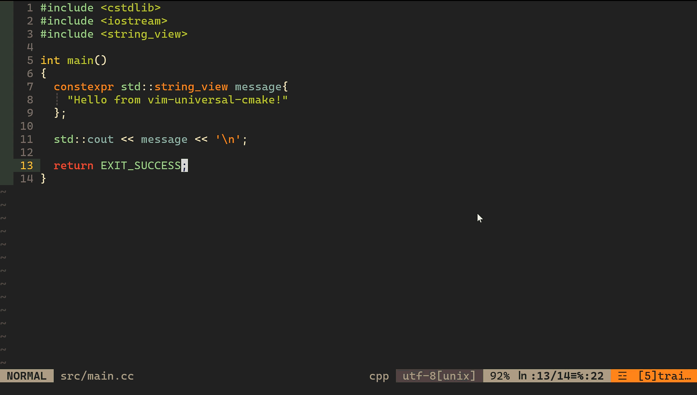
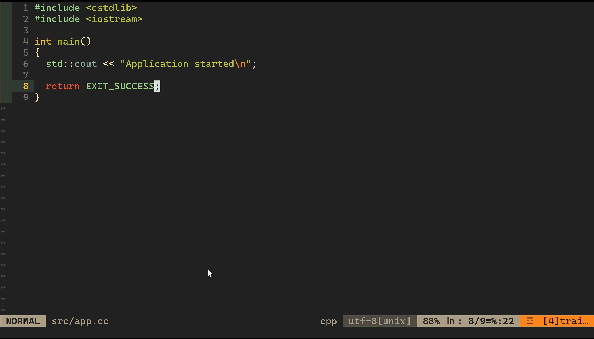

# vim-universal-cmake

> A unified CMake workflow for modern C and C++ development in Vim.

**CMake remains the Source of Truth. Vim becomes the interface.**

Build, run, test, debug, and analyze CMake projects without hardcoding compiler commands, manually managing executable paths, or maintaining project-specific build logic in your Vim configuration.

```text
F5   Build
F6   Build + Run
F7   Build + CTest
F8   Build + GDB
```

Powered by:

```text
CMake
CMake Presets
CMake File API
clangd
CoC
CTest
GDB
Valgrind
ASan / UBSan
Coverage
```

---

## vim-universal-cmake demo



## Multiple Executable Targets



## CMake Presets


---

# Why?

A CMake project already knows how it should be built.

```text
CMake
 ├── Compiler
 ├── C / C++ Standard
 ├── Include Paths
 ├── Compile Options
 ├── Link Options
 ├── Sanitizers
 ├── Targets
 ├── Artifacts
 └── Tests
```

However, a typical Vim workflow often duplicates this information:

```vim
g++ main.cpp -std=c++23 -Iinclude -Wall ...
```

or relies on project-specific mappings:

```vim
nnoremap <F5> :!g++ main.cpp -o app<CR>
nnoremap <F6> :!./app<CR>
```

This approach does not scale well.

Different projects may have:

* Different compilers
* Different C++ standards
* Different include paths
* Different build directories
* Multiple executable targets
* Debug / Release configurations
* CMake Presets
* Sanitizer configurations
* Tests
* Different executable output locations

The build configuration already exists in CMake.

> **Stop writing project-specific build commands in your Vim configuration.**

> **Let CMake describe the project. Let Vim drive the workflow.**

`vim-universal-cmake` provides a consistent Vim interface while allowing CMake to remain responsible for project configuration.

---

# Quick Start

For a simple CMake project, no additional project-specific Vim configuration is required.

```text
vim src/main.cpp
      ↓
F5
      ↓
Configure + Build
      ↓
F6
      ↓
Run
```

For a project using CMake Presets:

```text
Space bp
      ↓
Select Configure Preset
      ↓
Space bb
      ↓
Select Build Preset
      ↓
F5
      ↓
Build
```

For projects with multiple executable targets:

```text
Space bt
      ↓
Select Executable Target
      ↓
F6
      ↓
Build + Run
```

---

# What You Get

## Build

```text
F5
```

```text
Save
  ↓
Detect Project
  ↓
Configure if Necessary
  ↓
Build
```

---

## Run

```text
F6
```

```text
Save
  ↓
Build
  ↓
Discover Executable Targets
  ↓
Resolve Executable Artifact
  ↓
Run
```

---

## Test

```text
F7
```

```text
Save
  ↓
Build
  ↓
CTest
```

---

## Debug

```text
F8
```

```text
Save
  ↓
Build
  ↓
Resolve Executable
  ↓
Start GDB
```

---

# Why vim-universal-cmake?

| Typical Vim Build Workflow                | vim-universal-cmake                          |
| ----------------------------------------- | -------------------------------------------- |
| Hardcode compiler commands                | Uses the existing CMake project              |
| Duplicate include paths and flags         | CMake remains the Source of Truth            |
| Assume a build directory                  | Tracks the active build configuration        |
| Guess executable paths                    | Uses CMake File API artifacts                |
| Assume one executable                     | Supports multiple executable targets         |
| Manually switch build configurations      | Supports Presets and fallback configurations |
| Manually locate `compile_commands.json`   | Links the active compilation database        |
| Separate workflows for tests and analysis | Unified CMake-based workflow                 |

The central idea is:

```text
CMake describes the project.

Vim drives the workflow.
```

---

# Works With

`vim-universal-cmake` is designed to work with existing CMake projects.

Supported workflows include:

```text
✓ Simple single-executable projects
✓ Multiple executable targets
✓ CMakePresets.json
✓ CMakeUserPresets.json
✓ Preset inheritance
✓ Debug
✓ Release
✓ RelWithDebInfo
✓ MinSizeRel
✓ ASan
✓ UBSan
✓ Coverage
✓ CTest
✓ Monorepos
✓ GCC
✓ Clang
```

The workflow does not require a project-specific Vim configuration.

---

# Installation

Clone the repository:

```bash
git clone https://github.com/Jun19204/vim-universal-cmake ~/vim-universal-cmake
cd ~/vim-universal-cmake
```

## Fedora / RHEL

```bash
chmod +x install_for_fedora.sh
./install_for_fedora.sh
```

## Arch Linux

```bash
chmod +x install_for_arch.sh
./install_for_arch.sh
```

## Debian / Ubuntu

```bash
chmod +x install_for_debian.sh
./install_for_debian.sh
```

The installation scripts set up the required packages and the Vim development environment.

Main components:

```text
.vimrc
.vim/
├── coc-settings.json
├── autoload/
│   └── universal_cmake.vim
└── plugin/
    └── universal_cmake.vim
```

The following tools are generally required:

```text
GCC / Clang
CMake
Ninja
GDB
Valgrind
Node.js
ripgrep
```

---

# Core Architecture

```text
                    ┌───────────────────┐
                    │       Vim         │
                    └─────────┬─────────┘
                              │
                              ▼
                    ┌───────────────────┐
                    │ Universal CMake   │
                    │    Workflow       │
                    └─────────┬─────────┘
                              │
              ┌───────────────┼────────────────┐
              ▼               ▼                ▼
         Configure          Build         CMake File API
              │               │                │
              │               │         ┌──────┴──────┐
              │               │         ▼             ▼
              │               │    Executable       clangd
              │               │         │
              ▼               ▼         │
          CMake Preset      CTest       │
          or Fallback                   │
                                        ▼
                               ┌────────┼────────┐
                               ▼        ▼        ▼
                              Run      GDB    Valgrind
```

Vim does not separately manage the project's:

* Compiler
* C / C++ Standard
* Include Paths
* Compile Options
* Link Options
* Sanitizers
* Targets
* Tests

When the CMake configuration changes, the workflow follows the updated configuration.

---

# Complete Workflow

```text
Current File
    │
    ▼
Project Root Detection
    │
    ▼
Check Selected Configure Preset
    │
    ├── Configure Preset Selected
    │       │
    │       ▼
    │   Preset Configure
    │       │
    │       ▼
    │   Use Selected Build Preset
    │
    └── No Configure Preset Selected
            │
            ▼
        Fallback CMake
            │
            ▼
         Configure
            │
            ▼
           Build
            │
      ┌─────┼──────────────┐
      ▼     ▼              ▼
     Run  CTest       CMake File API
                             │
                     ┌───────┴────────┐
                     ▼                ▼
                Executable           clangd
                     │
              ┌──────┼──────┐
              ▼      ▼      ▼
             Run    GDB  Valgrind
```

The typical development flow is:

```text
Configure
    ↓
Build
    ↓
Run
    ↓
Test
    ↓
Debug
    ↓
Analyze
```

---

# Project Root Detection

The project root is discovered by walking upward from the directory containing the currently opened file.

Detection priority:

```text
Current File Location
      │
      ▼
CMakeUserPresets.json
      │
      ▼
CMakePresets.json
      │
      ▼
CMakeLists.txt
      │
      ▼
.git
      │
      ▼
Current Vim Working Directory
```

This allows the workflow to prefer the nearest CMake project even inside a monorepo.

Example:

```text
monorepo/
├── .git/
├── engine/
│   ├── CMakeLists.txt
│   ├── CMakePresets.json
│   └── src/
│       └── renderer.cpp
│
└── tools/
    └── CMakeLists.txt
```

When editing:

```text
engine/src/renderer.cpp
```

the selected project root becomes:

```text
monorepo/engine
```

---

# CMake Presets

The following preset files are supported:

```text
CMakePresets.json
CMakeUserPresets.json
```

Preset structures using `include` and `inherits` are also supported.

Example:

```json
{
  "name": "asan",
  "inherits": "base",
  "binaryDir": "${sourceDir}/build/asan"
}
```

Typical configurations include:

```text
debug
release
asan
ubsan
coverage
```

Sanitizer and coverage options are not hardcoded into the Vim configuration.

They are managed by the project's CMake configuration or CMake Presets.

---

## Select a Configure Preset

```text
Space bp
```

## Select a Build Preset

```text
Space bb
```

Typical workflow:

```text
Space bp
    ↓
Select Configure Preset
    ↓
Space bb
    ↓
Select Build Preset
    ↓
F5
    ↓
Build
```

For example, selecting an `asan` preset allows the workflow to use the configuration defined by that preset, including:

* `binaryDir`
* Compiler configuration
* Compile options
* Linker options
* Sanitizer configuration

Example:

```json
{
  "name": "asan",
  "inherits": "base",
  "cacheVariables": {
    "CMAKE_BUILD_TYPE": "Debug",
    "CMAKE_CXX_FLAGS":
      "-fsanitize=address -fno-omit-frame-pointer",
    "CMAKE_EXE_LINKER_FLAGS":
      "-fsanitize=address"
  }
}
```

---

# Preset Behavior

The presence of `CMakePresets.json` does not automatically switch the workflow to Preset mode.

> **A Preset is used only when a Configure Preset has been explicitly selected in the current Vim session.**

```text
Configure Preset Selected
    ↓
Preset-Based Configure / Build
```

If a Preset file exists but no Configure Preset has been selected:

```text
No Configure Preset Selected
    ↓
Fallback CMake
```

In other words:

```text
Preset Exists
    ≠
Preset Is Active
```

This makes it possible to use either a Preset-based build or the default fallback build for the same project.

---

# Fallback CMake

Not every CMake project needs CMake Presets.

When no Configure Preset is selected, the workflow uses a default CMake configure process.

Conceptually:

```bash
cmake -S <source-dir> \
      -B <build-dir> \
      -DCMAKE_BUILD_TYPE=<config> \
      -DCMAKE_EXPORT_COMPILE_COMMANDS=ON
```

If Ninja is available, the workflow may use the Ninja generator when appropriate.

Supported fallback build types:

```text
debug
release
relwithdebinfo
minsizerel
```

Therefore, even a simple project without Presets can be used directly.

```text
project/
├── CMakeLists.txt
└── src/
    └── main.cpp
```

```text
vim src/main.cpp
    ↓
F5
    ↓
Fallback Configure
    ↓
Build
```

---

# Build Directory

Fallback builds do not create arbitrary build directories inside the project.

The default location is:

```text
~/.cache/vim-cmake/
```

Conceptual layout:

```text
~/.cache/vim-cmake/
└── <project-hash>/
    ├── debug/
    ├── release/
    ├── relwithdebinfo/
    └── minsizerel/
```

Each project uses a hash-based directory, preventing build artifacts from different projects from colliding.

---

# CMake File API and Target Discovery

One of the core principles of this project is:

> **Executable paths are not guessed.**

A CMake project may contain:

```text
app
server
client
unit_tests
benchmark
```

Their output paths may differ depending on:

* Generator
* Build directory
* Build configuration
* CMake Preset
* Runtime output configuration

Instead of searching the build directory or assuming an executable name, `vim-universal-cmake` uses the **CMake File API**.

Workflow:

```text
Create Query
    ↓
CMake Configure
    ↓
codemodel-v2 Reply
    ↓
Parse Target JSON
    ↓
Resolve Artifacts
```

Typical target types include:

```text
EXECUTABLE
STATIC_LIBRARY
SHARED_LIBRARY
UTILITY
```

Only actual `EXECUTABLE` targets are considered runnable.

Example:

```text
my_app
└── EXECUTABLE

unit_tests
└── EXECUTABLE

my_library
└── STATIC_LIBRARY
```

Run, GDB, and Valgrind therefore operate on actual executable CMake targets rather than guessed executable paths.

---

# Executable Target Management

If the project contains only one executable target, it can be used directly.

If multiple executable targets exist, one can be selected.

## Select Executable Target

```text
Space bt
```

## Show All CMake Targets

```text
Space ba
```

Example:

```text
1. app
2. server
3. client
4. unit_tests
```

The selected executable target is used by:

```text
Run
GDB
Valgrind
```

For projects with multiple executable targets, selecting the desired target first is recommended.

```text
Space bt
```

---

# clangd and compile_commands.json

The C / C++ LSP environment uses:

```text
coc.nvim
    ↓
coc-clangd
    ↓
clangd
```

clangd requires accurate compilation information.

For CMake projects, this information is generally provided through:

```text
compile_commands.json
```

Example:

```text
project/
├── build/
│   └── debug/
│       └── compile_commands.json
│
├── src/
└── CMakeLists.txt
```

Rather than directly passing `--compile-commands-dir` to clangd or restarting CoC whenever the active build directory changes, this workflow creates a symbolic link in the project root that points to the compilation database of the active build directory.

Workflow:

```text
Check Current Session build_dir
        ↓
If unavailable, check the Project Root
        ↓
If unavailable, check an existing Fallback Build Directory
        ↓
If unavailable, check the selected Configure Preset's binaryDir
        ↓
If unavailable, perform Configure only
        ↓
Check compile_commands.json in the active build_dir
        ↓
Create a compile_commands.json symbolic link in the Project Root
```

The key principle is:

> **The `compile_commands.json` generated by the currently active Build Directory is the Source of Truth for compilation information.**

---

## Link compile_commands.json

```text
Space cl
```

Or:

```vim
:CMakeLinkCompileCommands
```

This makes `compile_commands.json` available from the project root.

It does not automatically install or configure CoC extensions or modify `coc-settings.json`.

---

# CTest

## Build + CTest

```text
F7
```

Workflow:

```text
Save Current File
    ↓
Build
    ↓
CTest
```

CTest configuration remains part of the CMake project.

Example:

```cmake
enable_testing()

add_test(
    NAME example_test
    COMMAND example_test
)
```

---

## Run CTest Directly

```text
Space tb
```

CTest runs in the currently active build directory.

---

## Run Tests Related to the Current File

```text
Space tc
```

The test name is filtered based on the current file name.

Example:

```text
Current File: example_test.cpp
    ↓
File Name: example_test
    ↓
Remove trailing _test
    ↓
example
    ↓
ctest -R example
```

If the file name does not end with `_test`, the file name without its extension is used directly.

This feature does not analyze source code or CMake targets to discover tests.

Instead, it passes a file-name-based pattern to:

```text
ctest -R
```

---

# GDB

## Start GDB

```text
F8
```

Or:

```text
Space bd
```

Conceptually, GDB is started as:

```bash
gdb -q <executable>
```

The workflow then performs:

```text
break main
run
```

---

## GDB Execution Control

| Key | GDB Command | Action                                                 |
| --- | ----------- | ------------------------------------------------------ |
| F10 | `next`      | Execute the next line without stepping into a function |
| F11 | `step`      | Step into a function                                   |
| F12 | `continue`  | Continue execution until the next breakpoint           |

These shortcuts send commands to an already running GDB session.

Therefore, GDB must be started first.

---

## Breakpoint at the Current Line

```text
Space bk
```

A breakpoint is added based on the current cursor location.

Conceptually:

```text
break /absolute/path/to/source.cpp:<current-line>
```

`Space bk` does not start a new GDB session.

Recommended workflow:

```text
F8 or Space bd
        ↓
Start GDB
        ↓
Space bk
        ↓
Add Breakpoint
        ↓
F10 / F11 / F12
```

---

# Valgrind

Valgrind runs against the selected executable target.

```text
Space bv
```

Typical options:

```text
--leak-check=full
--show-leak-kinds=all
--track-origins=yes
```

Because the executable is resolved through the active CMake configuration, Valgrind does not depend on a hardcoded executable path.

---

# ASan / UBSan / Coverage

Sanitizer and coverage options are not added directly to the Vim configuration.

They are managed through the project's CMake configuration or CMake Presets.

Example:

```text
Space bp
    ↓
Select asan
    ↓
Space bb
    ↓
Select ASan Build Preset
    ↓
F5
    ↓
Build
    ↓
F6
    ↓
Run
```

ASan, UBSan, and Coverage are not separate Vim features.

They are treated as **CMake Build Configurations** and run through the same workflow.

---

# Vim Development Features

## Source / Header Switching

```text
F4
```

Example:

```text
src/example.cpp
        ↕
include/example.hpp
```

Typical search paths:

```text
src/
include/
../src/
../include/
tests/
```

---

## File Navigation

| Key        | Action                    |
| ---------- | ------------------------- |
| Ctrl + n   | Toggle NERDTree           |
| Ctrl + p   | Search files with FZF     |
| Space + rg | Search code using ripgrep |

---

# clangd / CoC

| Key        | Action                |
| ---------- | --------------------- |
| `gd`       | Go to definition      |
| `gy`       | Go to type definition |
| `gi`       | Go to implementation  |
| `gr`       | Find references       |
| `K`        | Hover documentation   |
| `Space rn` | Rename symbol         |
| `Space cf` | Format code           |
| `F1`       | Toggle Inlay Hints    |

---

# Keybindings

## Build / Run / Test / Debug

| Key | Action                     |
| --- | -------------------------- |
| F5  | Save and Build             |
| F6  | Save, Build, and Run       |
| F7  | Save, Build, and Run CTest |
| F8  | Save, Build, and Start GDB |
| F10 | GDB `next`                 |
| F11 | GDB `step`                 |
| F12 | GDB `continue`             |

---

## CMake

| Key      | Action                   |
| -------- | ------------------------ |
| Space bc | Configure                |
| Space bp | Select Configure Preset  |
| Space bb | Select Build Preset      |
| Space bt | Select Executable Target |
| Space br | Build + Run              |
| Space ba | Show All Targets         |

---

## Other

| Key      | Action                            |
| -------- | --------------------------------- |
| Space tb | Run CTest                         |
| Space tc | Run Tests Related to Current File |
| Space bv | Run Valgrind                      |
| Space bd | Start GDB                         |
| Space bk | Add Breakpoint at Current Line    |
| Space cs | Show CMake Status                 |
| Space cr | Reset Project State               |
| Space cl | Link `compile_commands.json`      |

---

# Design Principles

1. **CMake is the Source of Truth for project configuration.**

2. **Vim does not duplicate compiler options or build configuration.**

3. **Preset-based workflows are used only when a Configure Preset has been explicitly selected.**

4. **If a Preset file exists but no Preset is selected, Fallback CMake is used.**

5. **Projects without Presets are supported through Fallback CMake.**

6. **The project root is discovered relative to the currently opened file.**

7. **Executable paths are not guessed; the CMake File API is used to discover targets and artifacts.**

8. **clangd uses compilation information from the currently active build directory.**

9. **ASan, UBSan, and Coverage are managed as CMake Build Configurations.**

10. **GDB and Valgrind operate on actual `EXECUTABLE` targets.**

---

# The Goal

The goal of this project is not to create a Vim configuration tied to a specific project.

Instead, `vim-universal-cmake` aims to provide a universal workflow for a wide range of C and C++ projects:

```text
CMake
CMake Presets
Multiple Targets
CTest
Debug / Release
ASan / UBSan
Coverage
Monorepo
```

through a single Vim interface:

```text
Configure
    ↓
Build
    ↓
Run
    ↓
Test
    ↓
Debug
    ↓
Analyze
```

```text
CMake describes the project.

Vim drives the workflow.
```

---

# Philosophy

```text
CMake
    │
    │  Source of Truth
    ▼
Project Configuration
    │
    ├── Compiler
    ├── Language Standard
    ├── Include Paths
    ├── Compile Options
    ├── Link Options
    ├── Targets
    ├── Tests
    └── Build Configurations
    │
    ▼
vim-universal-cmake
    │
    ▼
Configure
Build
Run
Test
Debug
Analyze
```

The project does not attempt to replace CMake.

It attempts to make working with existing CMake projects from Vim feel consistent.

> **CMake describes the project.**
>
> **Vim drives the workflow.**
